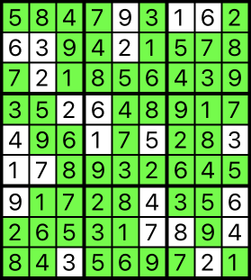

# Sudoku Solver

Simple Swift playground that shows the solution (if it exists) to a Sudoku puzzle.



The puzzle is defined using an array of arrays of `Int` values with `0` values indicating unknown values. Here is the configuration for a very hard
puzzle (shown above).

```
let puzzle = [
  [0, 0, 0, 0, 9, 0, 1, 6, 0],
  [6, 3, 0, 0, 2, 0, 0, 0, 0],
  [0, 2, 0, 0, 0, 0, 0, 0, 0],
  [0, 0, 2, 6, 0, 0, 0, 0, 0],
  [4, 0, 0, 1, 0, 5, 0, 0, 3],
  [1, 7, 0, 0, 0, 0, 0, 0, 0],
  [9, 0, 0, 0, 0, 4, 0, 0, 6],
  [0, 0, 0, 0, 0, 7, 8, 0, 4],
  [0, 0, 3, 0, 0, 0, 0, 2, 0]
]
```

Getting a solution:

```
let solved = Sudoku.solve(board: puzzle)
```

The playground shows the solution in green and the original puzzle values in white.
